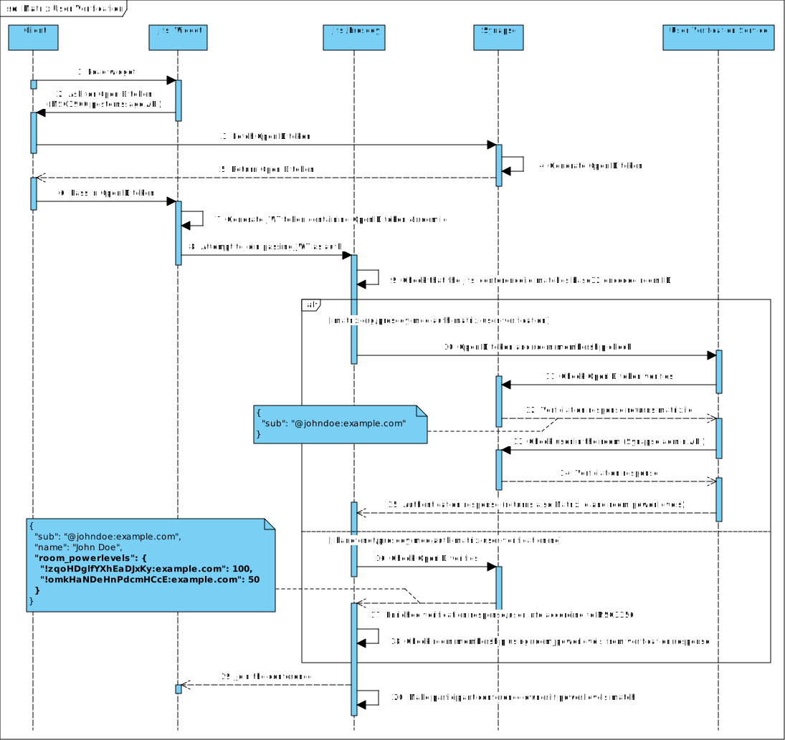

# Prosody Auth Matrix User Verification

## Description

_TBD_

 

## Configuration

_TBD_

```lua
VirtualHost "example.com"
    -- Enable Matrix User Verification
    authentication = "matrix_user_verification"
    -- Restrict access to homeservers with a subdomain of example.com
    matrix_homeserver_hostname_pattern = "[^.]+\\.example\\.com"
```